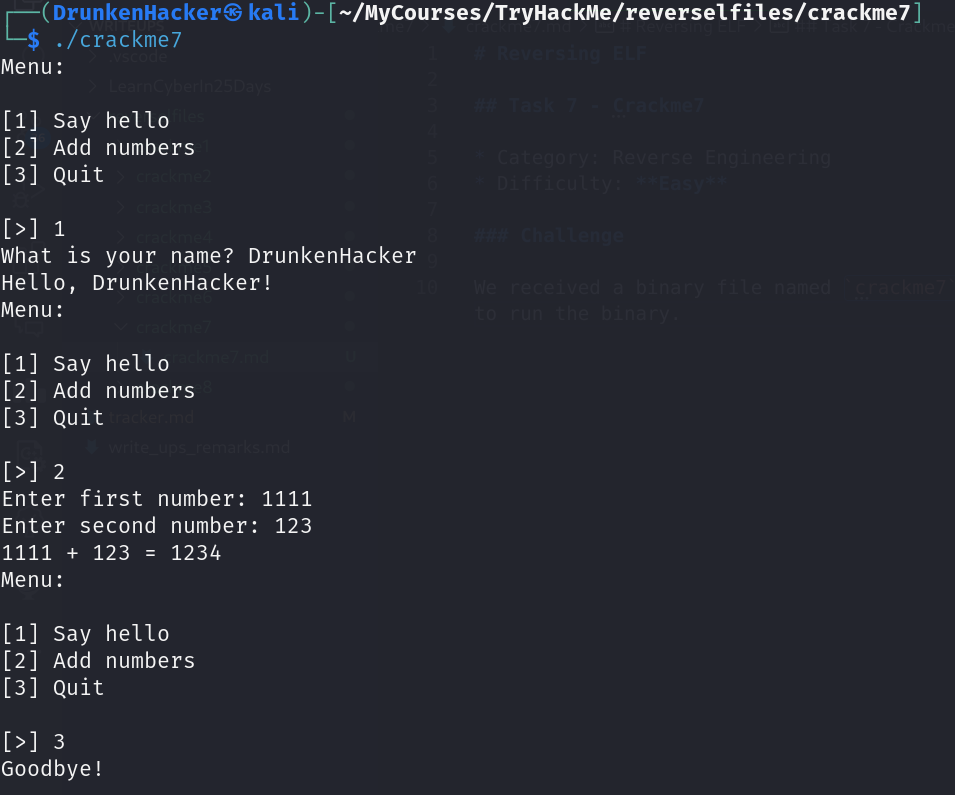
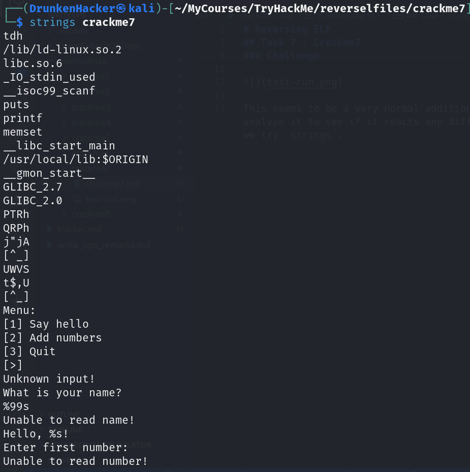
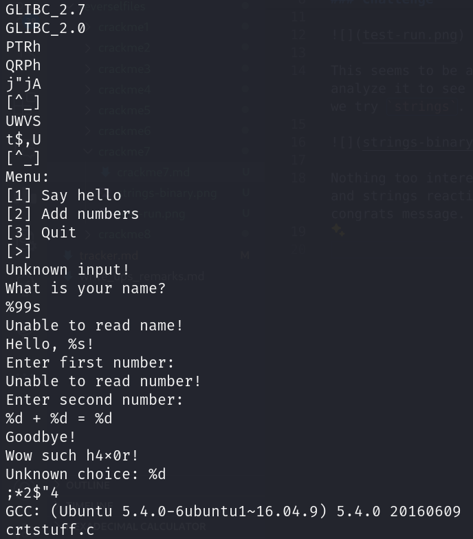
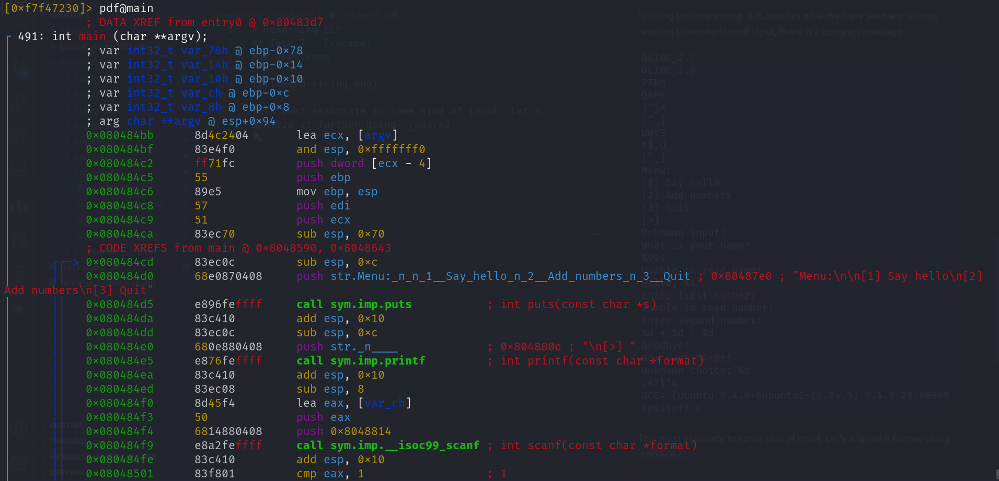
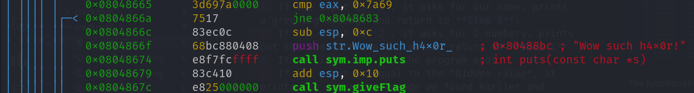
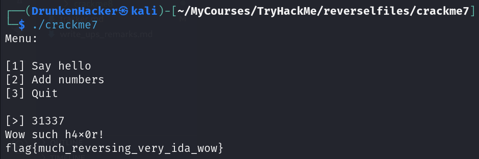

# Reversing ELF

## Task 7 - Crackme7

* Category: Reverse Engineering
* Difficulty: **Easy**

### Challenge

We received a binary file named `crackme7`. Let's try to run the binary.

This seems to be a very normal addition program. Let's analyze it to see if it reacts any differently. First, we try `strings`.

Nothing too interesting. But, besides what we have seen and strings reacting to wrong format input, there is a congrats message.

This must associate to some kind of input. Let's analyze it further using `radare2`.

The functionality of the program is all written in the **main** function. There is a lot of code but in short, the program functions as follows:
  1. The program asks for an integer.
  2. If the input is `1`, it asks for our name, prints a greeting message and return to **Step 1**.
  3. If the input is `2`, it asks for 2 numbers, prints out the addition expression and return to **Step 1**.
  4. If the input is `3`, the program ends.
  5. If the input is equal to the *hidden value*, it prints the congrats message we found earlier and calls a **giveFlag** function. This should be our goal.
  6. If the input is anything else, it prints an error message and return to **Step 1**.

Our hidden value is `0x7a69` which indeed translates to `31337`. Let's try to input `31337` and see if we can get the flag.

We got the flag! Let's move on to the next task.