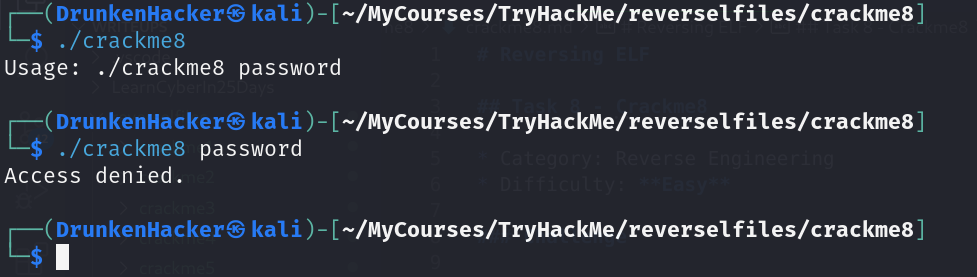
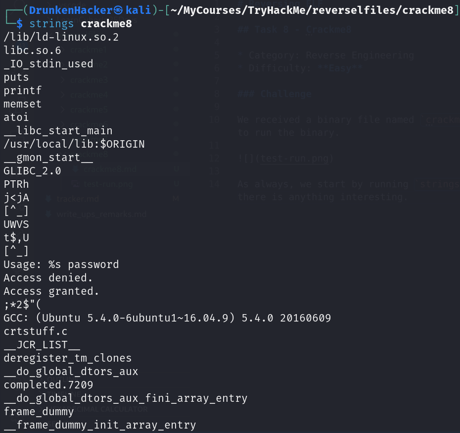
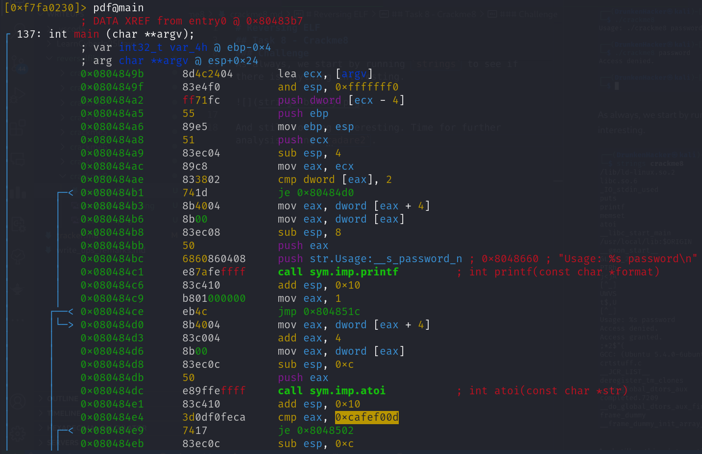
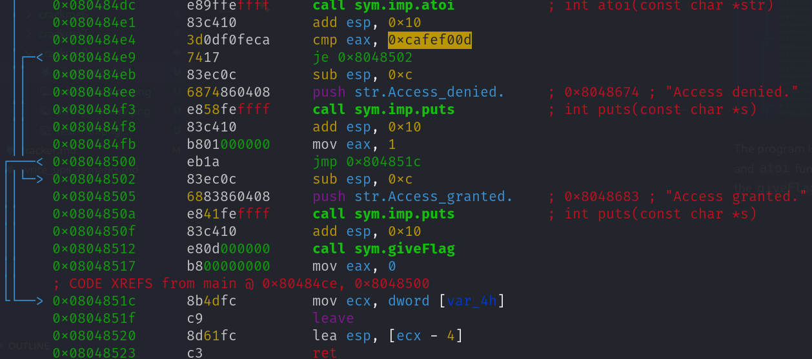
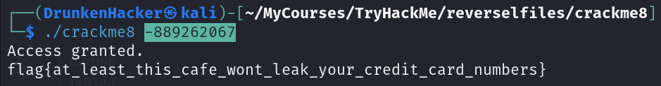

# Reversing ELF

## Task 8 - Crackme8

* Category: Reverse Engineering
* Difficulty: **Easy**

### Challenge

We received a binary file named `crackme8`. Let's try to run the binary.

As always, we start by running `strings` to see if there is anything interesting.

And still nothing interesting. Time for further analysis using `radare2`.

The program is quite simple. It reads an input string, passes it through and `atoi` function, compares the result with a *hidden value* and calls the `giveFlag` function if the result matches.

The hidden value is `0xcafef00d` in hex. Translate it to decimal, we get `3405705229`. However, the type of the result of `atoi` function must be `int` which is 32-bit. Hence, the value has to be negative which is `-889262067`.

We got the flag and finished the challenge!