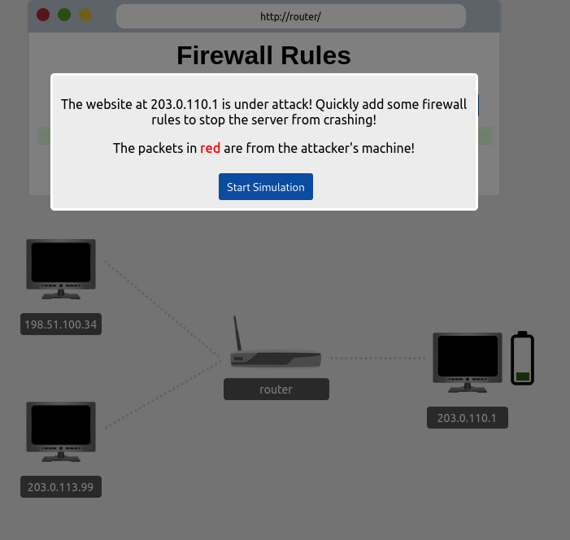

# Security Operations

## Description

Learn about Security Operations Center (SOC): its responsibilities, services, and data sources.
* Category: Walkthrough

### Introduction to Security Operations

A **Security Operations Center (SOC)** is a *team* of IT security professionals tasked with monitoring a company's network and systems 24 hours a day, 7 days a week. Their purpose of monitoring is to:
* **Find vulnerabilities on the network**
* **Detect unauthorized activity**
* **Discover policy violations**
* **Detect intrusions**
* **Support with the incident response**: An *incident* can be an observation, a policy violation, an intrusion attempt, or something more damaging such as a major breach. Responding correctly to a severe incident is not an easy task. The SOC can support the incident response team handle the situation.

### Elements of Security Operations

#### Data Sources

The SOC uses many data sources to monitor the network for signs of intrusions and to detect any malicious behaviour. Some of these sources are:
* **Server logs**: There are many types of servers on a network, such as a mail server, web server, and domain controller on MS Windows networks. Logs contain information about various activities, such as successful and failed login attempts, among many others.
* **DNS activity**: The SOC can gather information about domain names that internal systems are trying to communicate with by merely inspecting DNS queries.
* **Firewall logs**: Firewall logs can reveal much information about what packets passed or tried to pass through the firewall.
* **DHCP logs**: By inspecting DHCP transactions, we can learn about the devices that joined the network.

These are some of the most common data sources; however, many other sources can be used to aid in the network security monitoring and the other tasks of the SOC. A SOC might use a **Security Information and Event Management (SIEM)** system. The SIEM aggregates the data from the different sources so that the SOC can efficiently correlate the data and respond to attacks.

#### SOC Services

SOC services include reactive and proactive services in addition to other services.

**Reactive services** refer to the tasks initiated after detecting an intrusion or a malicious event. Example reactive services include:
* **Monitor security posture**: This is the primary role of the SOC, and it includes monitoring the network and computers for security alerts and notifications and responding to them as the need dictates.
* **Vulnerability management**: The SOC can assist in finding and patching vulnerabilities in the network.
* **Malware analysis**: The SOC might recover malicious programs that reached the network. The SOC can do basic analysis by executing it in a controlled environment. However, more advanced analysis requires sending it to a dedicated team.
* **Intrution detection**: The SOC maintains IDS systems, monitors its alerts and goes through its logs as needed to detect and log intrusions and suspicious packets.
* **Reporting**: Reporting incidents and alarms is necessary to ensure a smooth workflow and to support compliance requirements.

**Proactive services** refer to the tasks handled by the SOC without any indicator of an intrusion. Example proactive services include:
* **Network security monitoring (NSM)**: Monitor the network data analyze traffic to detect signs of intrusions.
* **Threat hunting**: With *threat hunting*, the SOC assumes an intrusion has already taken place and begins its hunt to see if they can confirm this assumption.
* **Threat intelligence**: Threat intelligence focuses on learning about potential adversaries and their tactics and techniques to improve the company’s defences. The purpose would be to establish a *threat-informed defence*.

Other services by SOC include **cyber security training**. Many data breaches and intrusions can be avoided by raising users’ security awareness and arming them with solid security training.

### Practical Example of SOC

In this example we will be monitoring a firewall on a simulation. Let's click on `View Site` to start the simulation.

As the simulation starts, we can see our server on the right side of the screen. It is connected to a router and so is 2 other machines.  
It is said that the website of the server is under attack and we need to add firewall rules to protect it. Since this is a simulation, we will be seeing malicious traffic in the form of red packets. All we need to do is see where the red packets are coming from and add firewall rules to block them. The rules should be as follows:

| Source IP Address | Destination IP Address | Source Port | Destination Port | Action |
|-------------------|------------------------|-------------|------------------|--------|
|<ATTACKING_IP>|<SERVER_IP>|ANY|80|DROP|

We are now ready! Time to start the simulation.