# Steel Mountain

## Description

Hack into a Mr. Robot themed Windows machine. Use metasploit for initial access, utilise powershell for Windows privilege escalation enumeration and learn a new technique to get Administrator access.
* Category: Walkthrough

## Introduction

We are given the IP address of the machine. Let's visit it in a web browser.

Here we see at the front page of Steel Mountain. Seems like our old friend Bill Harper is the employee of the month. Nice to see him again.

## Initial Access

Let's start by scanning the machine with nmap.

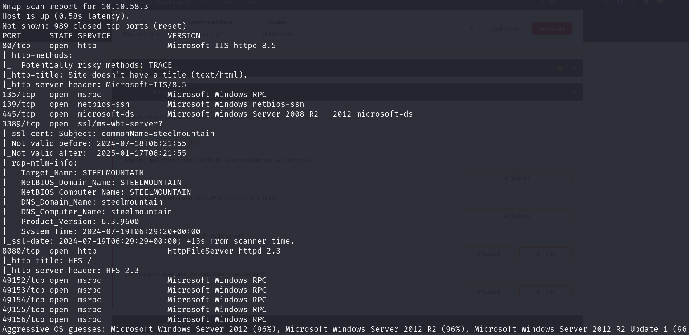

Our result shows that there is another web server running on port 8080. Let's visit it.

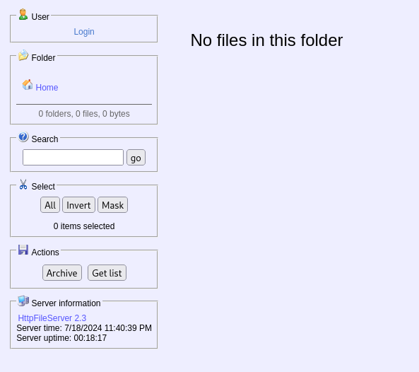

It is a Rejetto HTTP File Server. Let's use Metasploit to find an exploit for it.

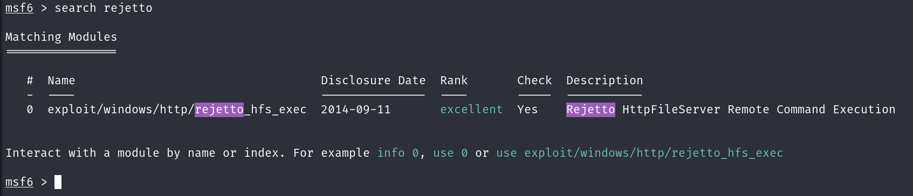

We found an exploit for it. Let's use it.

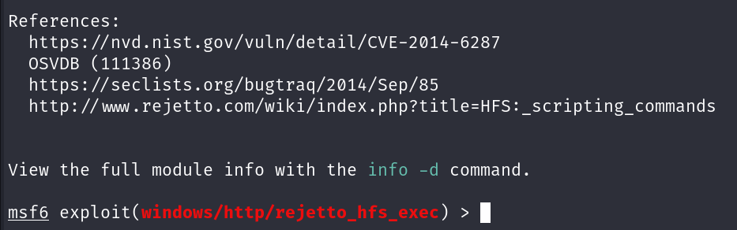

We found the CVE number for the exploit. Now let's set the options and run the exploit.

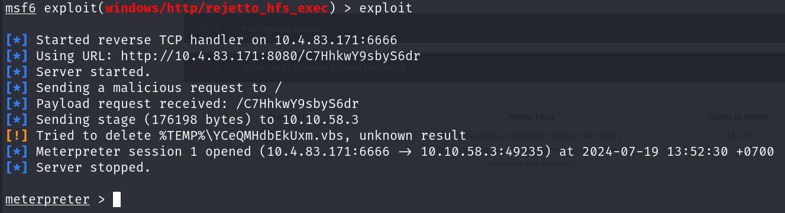

We have a meterpreter shell. Let's find the user flag.

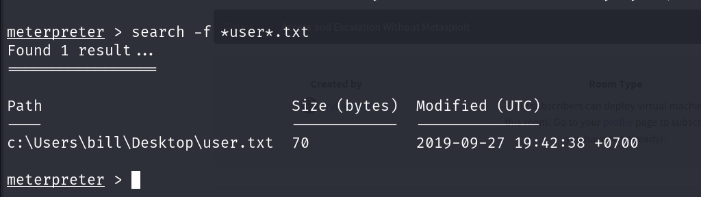

We found the user flag. Let's read it.

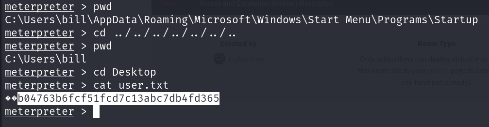

## Privilege Escalation

Now that we have a shell, let's find a way to escalate our privileges. Let's try uploading and running the PowerUp script.

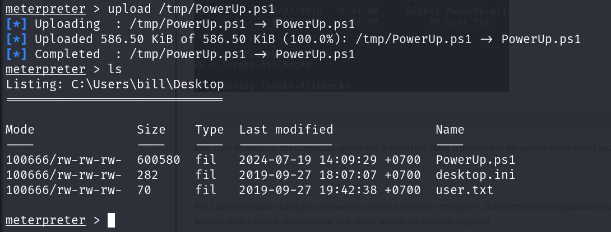

We uploaded the PowerUp script. Let's run it.

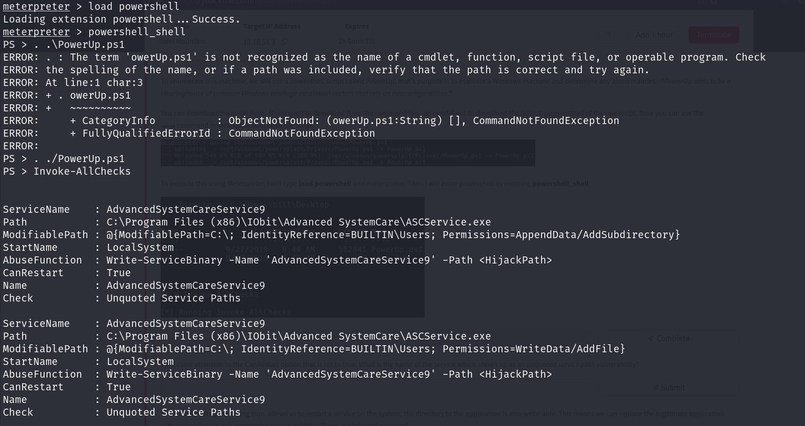

We found a service that we can exploit. We can restart the service on the system and the directory to the application will be writable. This means we can replace the legitimate application with our malicious one, restart the service, which will run our infected program!

First, let's create a reverse shell with msfvenom.

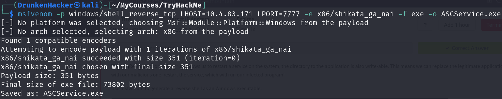

Now that our reverse shell is created, we need to upload it to the machine.

We uploaded the reverse shell. Now we need to replace the legitimate application with our malicious one.

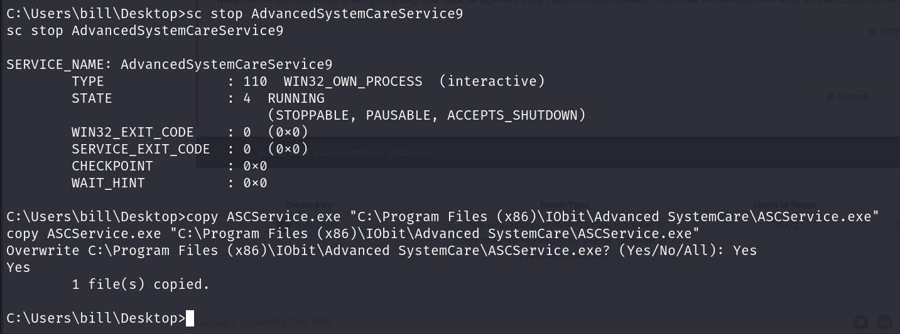

We replaced the legitimate application with our malicious one. Now we need set up a listener and restart the service.

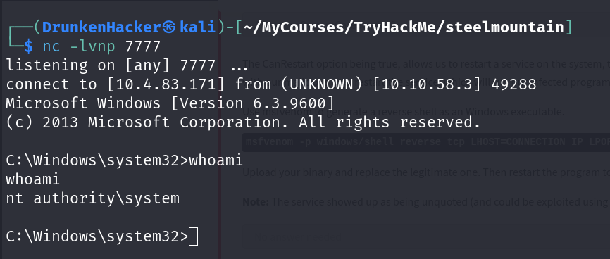

Now that we have a shell as SYSTEM, let's find the root flag.

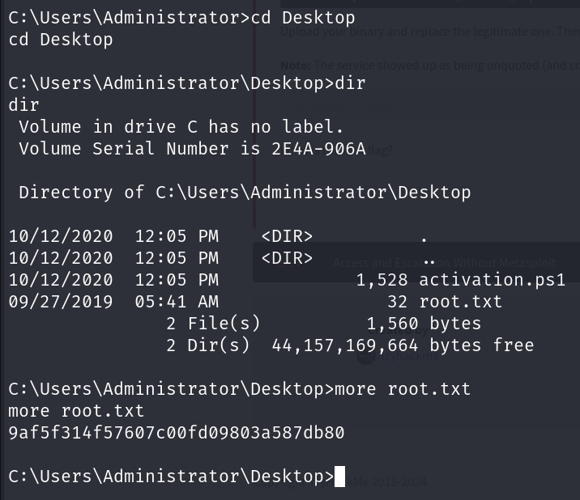

We found the root flag.