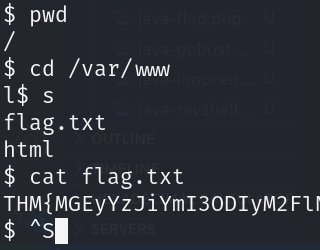
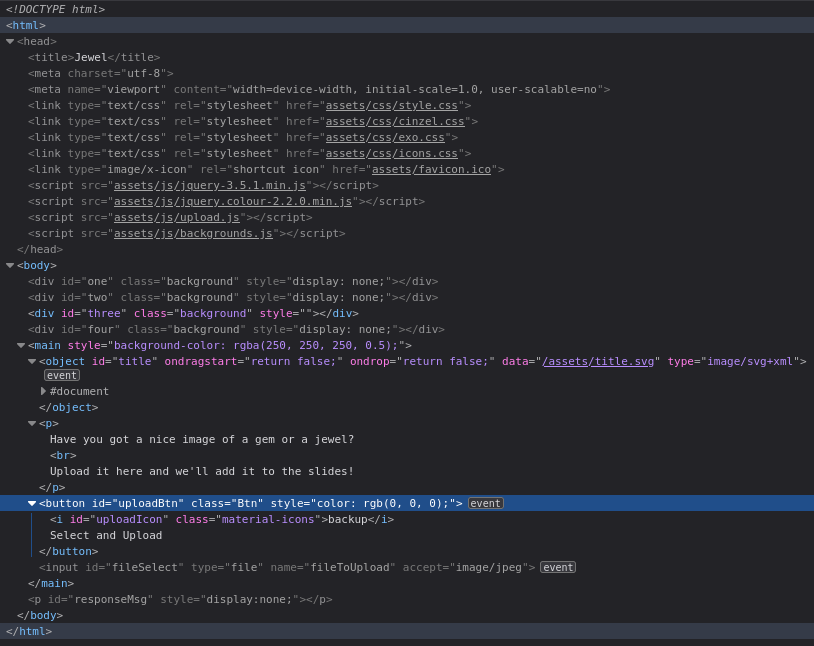

# Upload Vulnerabilities

## Description

Tutorial room exploring some basic file-upload vulnerabilities in websites.
* Category: Walkthrough

## Introduction

The ability to upload files to a server has become an integral part of how we interact with web applications. The applications for file upload features are limitless.

Unfortunately, when handled badly, file uploads can also open up severe vulnerabilities in the server. This can lead to anything from relatively minor, nuisance problems; all the way up to full Remote Code Execution (RCE) if an attacker manages to upload and execute a shell.

By uploading arbitrary files, an attacker could potentially also use the server to host and/or serve illegal content, or to leak sensitive information. Realistically speaking, an attacker with the ability to upload a file of their choice to your server with no restrictions is very dangerous indeed.

Some of the vulnerabilities resulting from improper (or inadequate) handling of file uploads include:
* Overwriting existing files
* Uploading and executing shells
* Bypassing client-side filtering
* Bypassing server-side filtering
* Fooling content-type checks

## General Methodology

As with any kind of hacking, enumeration is key. The more we understand about our environment, the more we're able to do with it.

Looking at the source code for the page is good to see if any kind of client-side filtering is being applied. Scanning with a directory bruteforcer such as **Gobuster** is usually helpful in web attacks, and may reveal where files are being uploaded to. Intercepting upload requests with **Burpsuite** will also come in handy. Browser extensions such as **Wappalyser** can provide valuable information at a glance about the site you're targetting.

With a basic understanding of how the website might be handling our input, we can then try to poke around and see what we can and can't upload. If the website is employing client-side filtering then we can easily look at the code for the filter and look to bypass it. If the website has server-side filtering in place then we may need to take a guess at what the filter is looking for, upload a file, then try something slightly different based on the error message if the upload fails. Uploading files designed to provoke errors can help with this. Tools like **Burpsuite** or **OWASP Zap** can be very helpful at this stage.

## Overwriting Existing Files

When files are uploaded to the server, a range of checks should be carried out to ensure that the file will not overwrite anything which already exists on the server.

If, however, no such precautions are taken, then we might potentially be able to overwrite existing files on the server. Realistically speaking, the chances are that file permissions on the server will prevent this from being a serious vulnerability.

### Challenge

As we first navigate to our target website `overwrite.uploadvulns.thm`, we are presented with a simple file upload form.

We are asked to overwrite a file. It is a good idea to look around and find out what can be overwritten. As we look at the source code of the page, we see the name of the image present on the page.

Let's overwrite the image with another image and see what happens.

We successfully overwrite the image with our own image. The flag is displayed on the page.

## Remote Code Execution

Remote Code Execution would allow us to execute code arbitrarily on the web server. Whilst this is likely to be as a low-privileged web user account, it's still an extremely serious vulnerability.

Remote code execution via an upload vulnerability in a web application tends to be exploited by uploading a program written in the same language as the back-end of the website or another language which the server understands and will execute. Traditionally this would be PHP, however, in more recent times, other back-end languages have become more common (Python Django, Javascript in the form of Node.js being prime examples).

It's worth noting that in a routed application, this method of attack becomes a lot more complicated and a lot less likely to occur. Most modern web frameworks are routed programmatically.

There are two basic ways to achieve RCE on a webserver when exploiting a file upload vulnerability: webshells, and reverse/bind shells.

Realistically a fully featured reverse/bind shell is the ideal goal for an attacker; however, a webshell may be the only option available (for example, if a file length limit has been imposed on uploads, or if firewall rules prevent any network-based shells).

As a general methodology, we would be looking to upload a shell of one kind or another, then activating it, either by navigating directly to the file if the server allows it (non-routed applications with inadequate restrictions), or by otherwise forcing the webapp to run the script for us (necessary in routed applications).

### Challenge

First, we navigate to our target website `shell.uploadvulns.th` and are presented with a simple file upload form.

As always, it is a good idea to look at the source code of the page. This time we did not find anything useful in the source code.

Let's go ahead and upload an innocent image and see what happens.

Nothing much happens. Let's use `gobuster` and see if we can find an upload directory.

There is a directory called `resources`. Let's check it out.

And it is the directory where the files are being uploaded. We can also see the image we uploaded as well, which is a good sign. Let's try to upload a PHP reverse shell.

The reverse shell is uploaded successfully. Let's try to access the reverse shell. We need to start a listener on our machine and then navigate to the reverse shell.

We successfully get a reverse shell. Let's look around and find the flag.

And we got the flag.

## Filtering

Regardless of the language being used, a client-side script will be run in our web browser. In the context of file-uploads, this means that the filtering occurs before the file is even uploaded to the server.

In an ideal world, this would be a good thing. However, because the filtering is happening on our computer, it is trivially easy to bypass. As such client-side filtering by itself is a highly insecure method of verifying that an uploaded file is not malicious.

Conversely, a server-side script will be run on the server. Traditionally PHP was the predominant server-side language. However, in recent years, other options (C#, Node.js, Python, Ruby on Rails, and a variety of others) have become more widely used.

Server-side filtering tends to be more difficult to bypass, as we don't have the code in front of us. As the code is executed on the server, in most cases it will also be impossible to bypass the filter completely; instead we have to form a payload which conforms to the filters in place, but still allows us to execute our code.

### Types of Filtering

#### Extension Validation

In theory, file extensions are used to identify the contents of a file. In practice they are very easy to change, so actually don't mean much; however, Microsoft Windows still uses them to identify file types. Filters that check for extensions work in one of two ways. They either blacklist extensions or they whitelist extensions.

#### File Type Filtering

Similar to Extension validation, but more intensive, file type filtering looks, once again, to verify that the contents of a file are acceptable to upload. We'll be looking at two types of file type validation:
* **MIME Validation**: MIME (Multipurpose Internet Mail Extension) types are used as an identifier for files - originally when transfered as attachments over email, but now also when files are being transferred over HTTP(S). The MIME type for a file upload is attached in the header of the request.  
MIME types follow the format `<type>/<subtype>`.The MIME type for a file can be checked client-side and/or server-side; however, as MIME is based on the extension of the file, this is extremely easy to bypass.
* **Magic Number Validation**: Magic numbers are the more accurate way of determining the contents of a file; although, they are by no means impossible to fake. The *"magic number"* of a file is a string of bytes at the very beginning of the file content which identify the content.  
Unlike Windows, Unix systems use magic numbers for identifying files; however, when dealing with file uploads, it is possible to check the magic number of the uploaded file to ensure that it is safe to accept. This is by no means a guaranteed solution, but it's more effective than checking the extension of a file.

#### File Length Filtering

File length filters are used to prevent huge files from being uploaded to the server via an upload form. In most cases this will not cause us any issues when we upload shells; however, it's worth bearing in mind that if an upload form only expects a very small file to be uploaded, there may be a length filter in place to ensure that the file length requirement is adhered to.

#### File Name Filtering

Files uploaded to a server should be unique. Usually this would mean adding a random aspect to the file name, however, an alternative strategy would be to check if a file with the same name already exists on the server, and give the user an error if so.

Additionally, file names should be sanitised on upload to ensure that they don't contain any "bad characters", which could potentially cause problems on the file system when uploaded.

#### File Content Filtering

More complicated filtering systems may scan the full contents of an uploaded file to ensure that it's not spoofing its extension, MIME type and Magic Number. This is a significantly more complex process than the majority of basic filtration systems employ.

#### Conclusion

It's worth noting that none of these filters are perfect by themselves. They will usually be used in conjunction with each other, providing a multi-layered filter, thus increasing the security of the upload significantly. Any of these filters can all be applied client-side, server-side, or both.

Similarly, different frameworks and languages come with their own inherent methods of filtering and validating uploaded files. As a result, it is possible for language specific exploits to appear.

## Bypassing Client-Side Filtering

As mentioned previously, client-side filtering tends to be extremely easy to bypass, as it occurs entirely on a machine that we control. When we have access to the code, it's very easy to alter it.

There are four easy ways to bypass your average client-side file upload filter:
* *Turn off Javascript in our browser*: If the site does not need Javascript in order to provide basic functionality, then turning it off will prevent the filter from running.
* *Intercept and modify the incoming page*: Using Burpsuite, we can intercept the incoming web page and strip out the Javascript filter before it has a chance to run.
* *Intercept and modify the file upload*: Intercept and modify the file upload after it passes through the filter, but before it is sent to the server.
* *Send the file directly to the upload point*: Posting the data directly to the page which contains the code for handling the file upload is another effective method for completely bypassing a client side filter.

### Challenge

First, we navigate to our target website `java.uploadvulns.thm` and are presented with a simple file upload form.

As always, it is a good idea to look at the source code of the page.

There isn't a path of the upload directory in the source code. Fortunately, we can see that the page loads a Javascript file called `client-side-filter.js`. We might want to strip this filter later on as we try to exploit the upload vulnerability. But first, we still need to find the upload directory. Time to use `gobuster`.

There is a directory called `images`. Let's check it out.

This could be it. Let's try to upload an image and see what happens.

As we keep trying different images, we see that the filter is blocking us. After a few tries, we found out that the filter accepts `.png` images. We uploaded a `.png` image of Spongebob to verify the directory.

The image is uploaded successfully. And we can see the image. Now we need to bypass the filter and upload a PHP reverse shell. Let's strip the Javascript filter using **Burpsuite**.

We need to turn on the proxy in **Burpsuite** and intercept the response as we request the page. We can then delete the line that loads the `client-side-filter.js` file.

Now let's try and see if we can upload the PHP reverse shell.

The reverse shell is uploaded successfully. Let's try to access the reverse shell. We need to start a listener on our machine and then navigate to the reverse shell.

And we are in. Time to look for the flag.

And we got the flag.

## Bypassing Server-Side Filtering: File Extensions

Client-side filters are easy to bypass as we can see the code for them, even if it's been obfuscated and needs processed before we can read it.

This is not the case with server-side filters. We have to perform a lot of testing to build up an idea of what is or is not allowed through the filter, then gradually put together a payload which conforms to the restrictions.

The key to bypassing any kind of server side filter is to enumerate and see what is allowed, as well as what is blocked; then try to craft a payload which can pass the criteria the filter is looking for.

### Challenge

We navigate to our target website `annex.uploadvulns.thm` and are presented with a console to upload files.

Let's type in `help` to see what commands are available.

Weird but okay. Let's try uploading an image and see what happens.

The image is uploaded successfully. Now we need to find the upload directory. Let's use `gobuster`.

There is a directory called `privacy`. Let's check it out.

It is indeed the directory where the files are being uploaded. There seems to be some changes to our file name. The timestamp is being added to the file name. But that is not a problem as we can still see the image we uploaded. Let's try to upload a PHP reverse shell.

Uh-oh. Seems like there is a server-side filter in place. Maybe it is checking for the file extension. As we have successfully uploaded an `.jpg` image, let's try changing the extension of the PHP reverse shell to `.jpg` and see if it gets uploaded.

Okay, the file is uploaded successfully. But does it work though? Let's try to access the reverse shell. We need to start a listener on our machine and then navigate to the reverse shell.

Yeah, should have predicted that. Let's try changing the extension to other PHP extensions and see if it works.

And we got one with `.php5`! Let's try to access the reverse shell. We need to start a listener on our machine and then navigate to the reverse shell.

And we are in! Time to look for the flag.

And we got the flag.

## Bypassing Server-Side Filtering: Magic Numbers

The magic number of a file is a string of hex digits, and is always the very first thing in a file. Knowing this, it's possible to use magic numbers to validate file uploads, simply by reading those first few bytes and comparing them against either a whitelist or a blacklist. This technique can be very effective against a PHP based webserver. However, it can sometimes fail against other types of webserver.

### Challenge

First, we navigate to our target website `magic.uploadvulns.thm` and are presented with a simple file upload form.

Let's try uploading an image and see what happens.

It's saying that only GIFs are allowed. Let's try uploading a GIF image and see what happens.

The GIF image is uploaded successfully. Now we need to find the upload directory. Let's use `gobuster`.

Gobuster reveals to us that there is a directory called `graphics`. Let's check it out.

The directory is forbidden. But let's not give up here. Let's try to see if we can access the GIF image we uploaded.

Yes indeed! We can access the GIF image! Now let's try to upload a PHP reverse shell with the magic number of a GIF image. First, we need to find what the magic number of a GIF image is. Let's look it up.

So we have 2 options here. Either way, we need to change the first 6 bytes of the PHP reverse shell to the magic number of a GIF image. With that in mind, let's add 6 characters to the beginning of the PHP reverse shell.

Now we use `hexeditor` to change the first 6 bytes of the PHP reverse shell to the magic number of a GIF image.

Let's save the file and verify it with `file`.

It is ready! Let's upload our reverse shell and see if it works.

The reverse shell is uploaded successfully. Let's try to access the reverse shell. We need to start a listener on our machine and then navigate to the reverse shell.

That is one magical reverse shell from our magical duck! Time to look for the flag.

And we got the flag.

## Black-Box Challenge

We navigate to our target website `jewel.uploadvulns.thm` and are presented with a simple file upload form.

Let's look at the source code of the page to see if we can find anything useful.

So seems like they only allow `image/jpeg` files. There is also some kind of suspicious `background.js` file loaded. Let's try uploading an image and see what happens.

The image is uploaded successfully. Now we need to find the upload directory. Let's use `gobuster`.

There is a directory called `content`. Let's check it out.

We cannot access the directory directy. But out of our results from `gobuster`, this is the most likely directory to be the upload directory. Let's run `gobuster` against this directory with the provided wordlist. This time, we will look for `.jpg` and `.jpeg` file extensions.

Our suspicions were correct. This is the upload directory. Not only did we find the 4 images that cycle on the front page here, but we also found the image we uploaded.

Now we want to upload a reverse shell. But first we need to see what is inside the `background.js` and `upload.js` files. Let's turn on the proxy in **Burpsuite** and try intercepting these files.

Just code for the background slideshow. Nothing useful here. Let's check the `upload.js` file.

Okay! We are getting somewhere. Not only the `upload.js` is responsible for uploading the files, there are also several filters in place. Let's delete these filters to prevent it from loading to the page.

Okay, now there is no more client-side filtering. But is there any kind of server-side filters? Let's test it out with a bogus file.

Maybe there are still some whitelist filter on the server. Let's see if it is the MIME type filter. We need to intercept the upload request and change its type to `image/jpeg` before it reaches the server.

Gotcha! There is only a MIME type filter here. Next we need to know what kind of backend the server is running to craft our reverse shell. We can see in the header of the responses, there is a `X-Powered: Express` header. This means the server is running on **Node.js**. Therefore, we need to craft a reverse shell in **Node.js**.

Now with the same technique, let's upload our reverse shell.

The reverse shell is uploaded successfully. Now we need to find it with `gobuster` again.

Here we see 4 initial images. The other files should contain our reverse shell and our successfully uploaded bogus tests.

Unfortunately for us, we can not access our file directly to see exactly which one is our reverse shell as our files have been renamed. We need to use `curl` to check this.

Great! Now that we know which one is our shell, all we need to do left is to find a way to execute it.

As we recall from the first `gobuster` result, there is an `/admin` page. Let's check it out and see if there is anything interesting.

A page to activate modules! How convenient! We might be able to execute our reverse shell. Let's start a listener and try entering `../content/IGE.jpg` in the `Module Name` field.

Holy shiny jewelry! Not only we have a shell, we are now root! Time to find our flag!

And we got it!