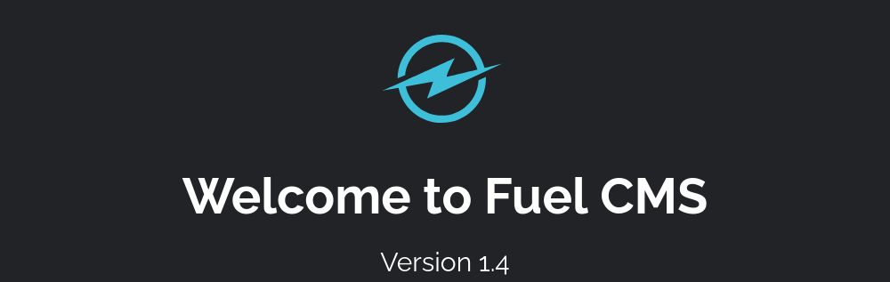
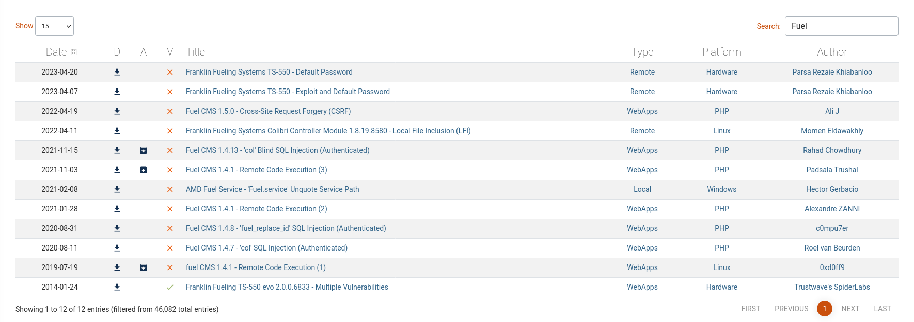
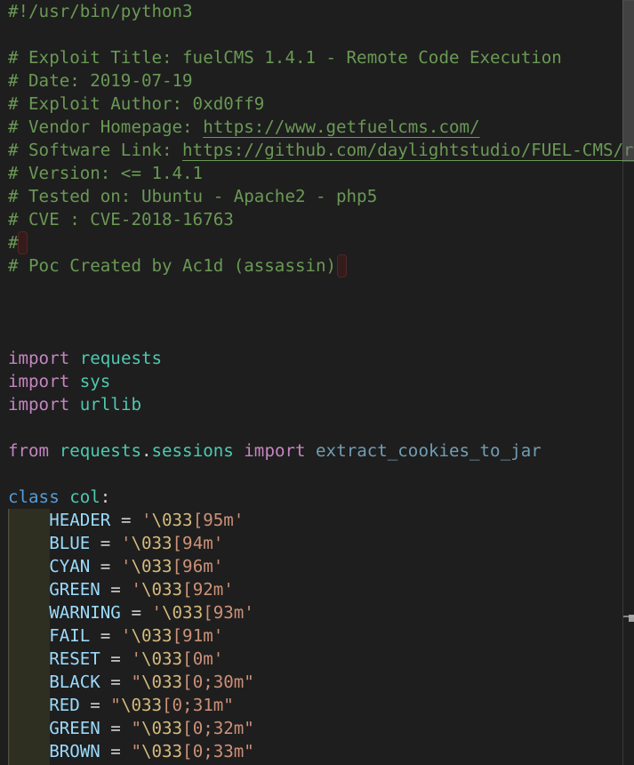
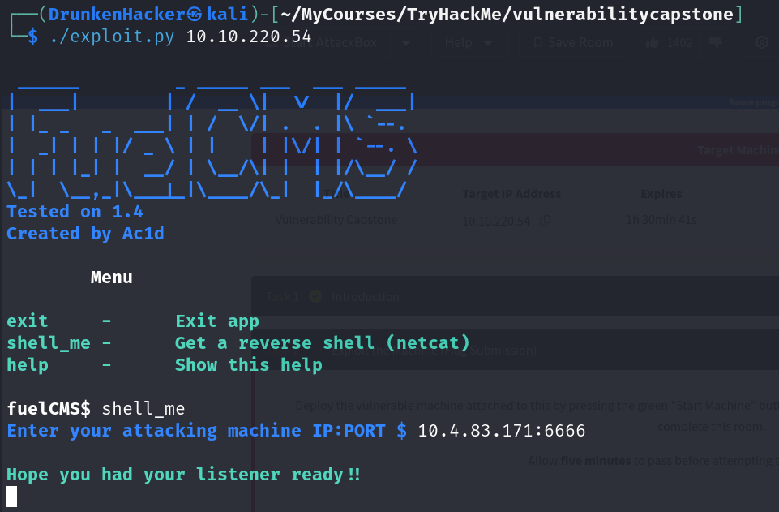
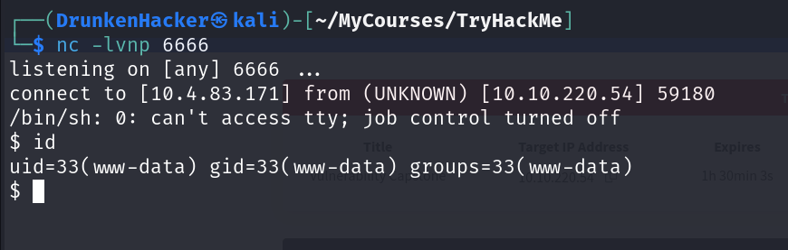
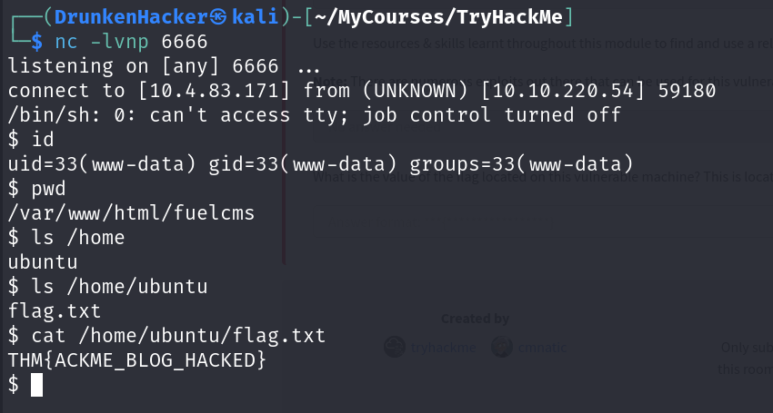

# Vulnerability Capstone

## Description

Apply the knowledge gained throughout the Vulnerability Module in this challenge room.
* Difficulty: **Easy**
* Category: Exploitation Search

## Introduction

Ackme Support Incorporated has recently set up a new blog. Their developer team have asked for a security audit to be performed before they create and publish articles to the public.

It is our task to perform a security audit on the blog; looking for and abusing any vulnerabilities that we find.

## Exploit the Machine

We are given the IP address of the blog. Let's first visit the blog and see what we can find.

We are greeted with a page introducing the service running on the blog. We can also see its version number. Now let's try to find vulnerabilities related to this service with ExploitDB.

We can see that there is a RCE vulnerability for this version of the service that has an exploit available. Let's try using this exploit. First, we copy the exploit code and save it to a file and change the IP address to the blog's IP address.

Now let's run the exploit and see if we can get a shell.

And we have a shell! Now we can look around the system and see what we can find.

And we have the flag!