# Vulnversity

## Description

Learn about active recon, web app attacks and privilege escalation.
* Category: Walkthrough

## Reconnaissance

We are given the IP address of the target machine. Let's start by scanning the target machine using Nmap.

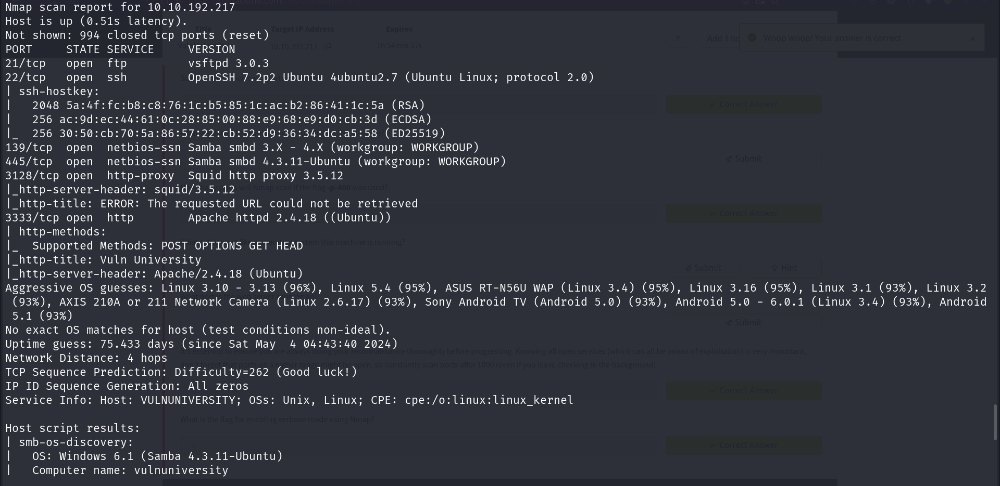

The Nmap scan shows that the target machine has 6 open ports. There are FTP, SSH, HTTP server, HTTP proxy and SMB services running on the target machine. The target machine is running the Squid HTTP proxy version 3.5.12. The OS of the target machine is very likely to be Ubuntu.

## Locating directories using GoBuster

Now that we know there is a web server running on the target machine, let's visit it in the browser.

There seems to be nothing much interesting on the front page of the website. Let's scan it with GoBuster to see if there are any hidden directories.

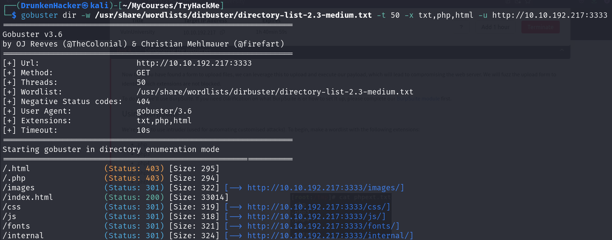

The result shows that there is an `/internal` directory on the website. Let's visit it in the browser.

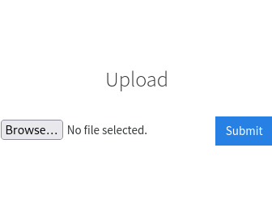

It's an upload page. Let's try to upload a reverse shell to the target machine. First, we need to prepare the reverse shell. We're going to use the PHP reverse shell from Pentest Monkey as the web server is clearly running PHP.

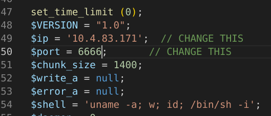

After setting our IP address and port in the reverse shell code, let's upload it to the target machine.

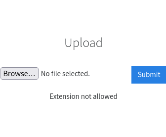

The upload attempt failed. It seems that the website is filtering the file extension. Let's try to bypass it by changing the file extension to `.phtml`.

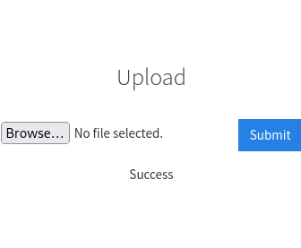

The upload was successful. But we need to find the uploaded file on the target machine. Let's run GoBuster against the `/internal` directory to see if there are any hidden files.

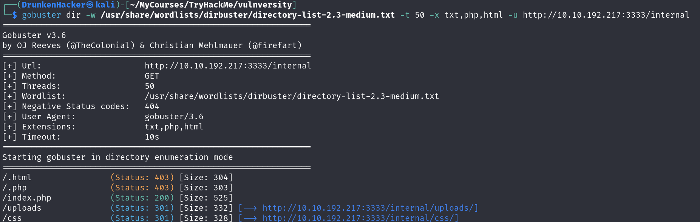

The result shows that there is a `/internal/uploads` directory. Let's visit it in the browser.

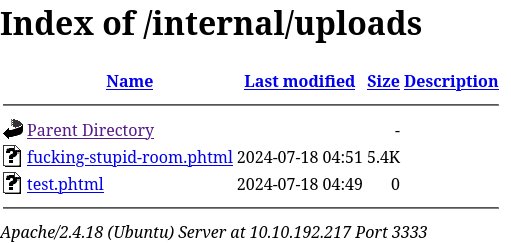

The reverse shell is there. Let's start a Netcat listener on our machine and visit the reverse shell in the browser.

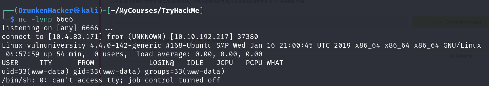

We have a shell on the target machine. Let's look around to see if there is any user on the target machine. To do this, it is a good idea to use `cat` to read the contents of the `/etc/passwd` file.

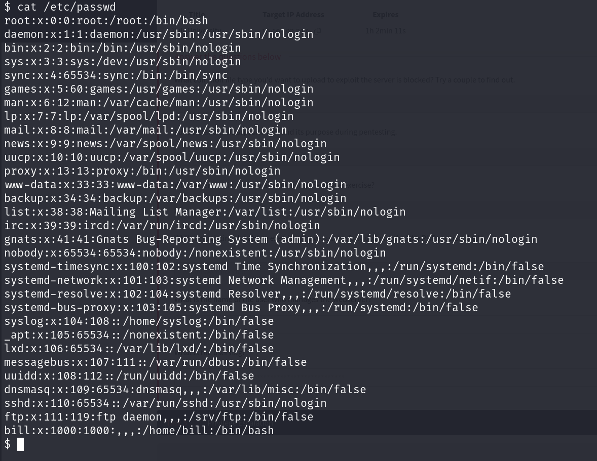

The `/etc/passwd` file shows that there is a user named `bill` on the target machine. Let's visit the home directory of `bill` to see if there is any interesting file.

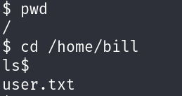

There is a file named `user.txt` in the home directory of `bill`. Let's read the content of the file.

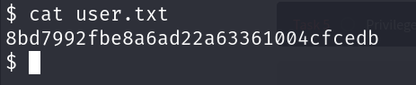

We have the user flag. Let's escalate our privilege to root.

## Privilege Escalation

Now we need to escalate our privilege to root. Let's find the SUID files on the target machine.

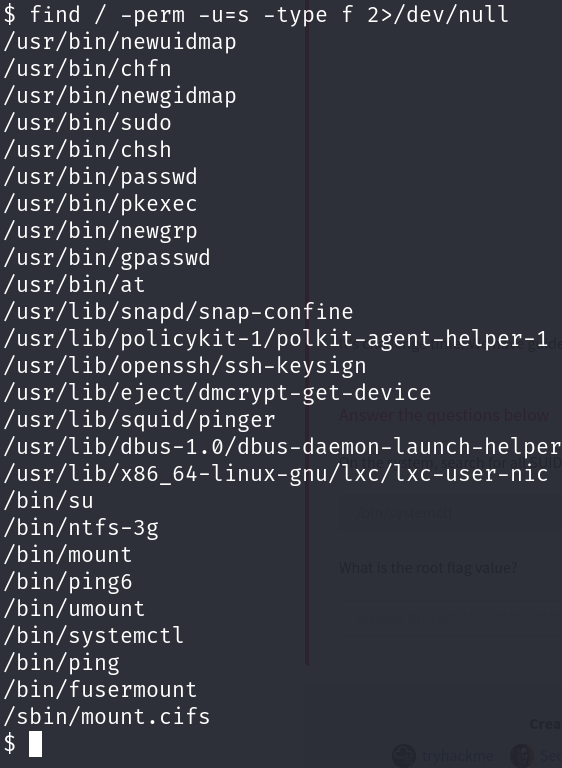

Among the SUID files, there is an interesting file named `systemctl`. We can exploit this file to escalate our privilege to root. Let's try creating a service file so that we can run it as root with `systemctl`.

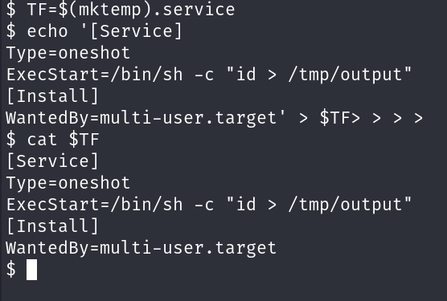

The service file was created successfully. Let's start the service.

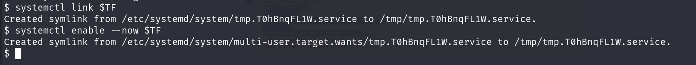

Let's check the `/tmp/output` file to see if the service was run successfully.

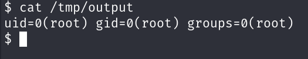

The service was run successfully. Now we try again but this time instead of `"id > /tmp/output"`, we will list the content of the root directory to find the root flag.

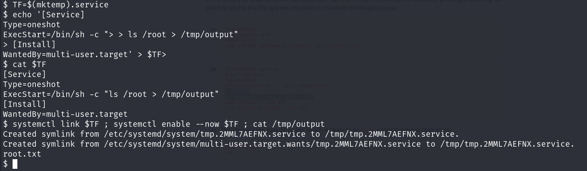

There is a file named `root.txt` in the root directory. Let's read the content of the file with the service.

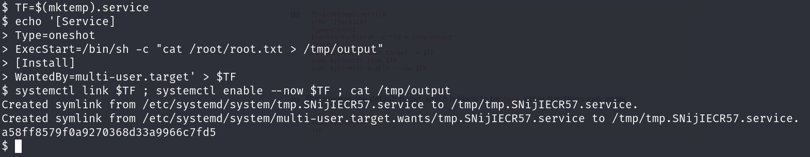

And we have the root flag.