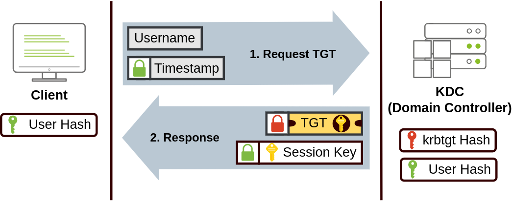

# Active Directory Basics

## Description

This room will introduce the basic concepts and functionality provided by Active Directory.
* Category: Walkthrough

## Windows Domains

Let's picture ourself administering a small business network with only five computers and five employees. In such a tiny network, we will probably be able to configure each computer separately without a problem. We will manually log into each computer, create users for whoever will use them, and make specific configurations for each employee's accounts. If a user's computer stops working, we will probably go to their place and fix the computer on-site.

Now suppose our business grows and has 157 computers and 320 different users located across four different offices. We now wouldn't be able to manage the network in the same way as before.

To overcome these limitations, we can use a Windows domain. Simply put, a **Windows domain** is a group of users and computers under the administration of a given business. The main idea behind a domain is to centralise the administration of common components of a Windows computer network in a single repository called **Active Directory (AD)**. The server that runs the Active Directory services is known as a **Domain Controller (DC)**.

The main advantages of having a configured Windows domain are:
* **Centralised identity management**: All users across the network can be configured from Active Directory with minimum effort.
* **Managing security policies**: We can configure security policies directly from Active Directory and apply them to users and computers across the network as needed.

## Active Directory

The core of any Windows Domain is the **Active Directory Domain Service (AD DS)**. This service acts as a catalogue that holds the information of all of the "objects" that exist on our network. Amongst the many objects supported by AD, we have users, groups, machines, printers, shares and many others.

### Users

Users are one of the most common object types in Active Directory. Users are one of the objects known as **security principals**, meaning that they can be authenticated by the domain and can be assigned privileges over resources like files or printers. We could say that a security principal is an object that can act upon resources in the network.

Users can be used to represent two types of entities:
* **People**: users will generally represent persons in our organisation that need to access the network, like employees.
* **Services**: we can also define users to be used by services like IIS or MSSQL. Every single service requires a user to run, but service users are different from regular users as they will only have the privileges needed to run their specific service.

### Machines

Machines are another type of object within Active Directory. For every computer that joins the Active Directory domain, a machine object will be created. Machines are also considered "security principals" and are assigned an account just as any regular user. This account has somewhat limited rights within the domain itself.

The machine accounts themselves are local administrators on the assigned computer, they are generally not supposed to be accessed by anyone except the computer itself, but as with any other account, if we have the password, we can use it to log in.

Identifying machine accounts is relatively easy. They follow a specific naming scheme. The machine account name is the computer's name followed by a dollar sign. For example, a machine named `DC01` will have a machine account called `DC01$`.

### Security Groups

We can define user groups to assign access rights to files or other resources to entire groups instead of single users. This allows for better manageability as we can add users to an existing group, and they will automatically inherit all of the group's privileges. Security groups are also considered security principals and, therefore, can have privileges over resources on the network.

Groups can have both users and machines as members. If needed, groups can include other groups as well.

Several groups are created by default in a domain that can be used to grant specific privileges to users. As an example, here are some of the most important groups in a domain:

| Security Group | Description |
| - | - |
| Domain Admins | Users of this group have administrative privileges over the entire domain. By default, they can administer any computer on the domain, including the DCs. |
| Server Operators | Users in this group can administer Domain Controllers. They cannot change any administrative group memberships. |
| Backup Operators | Users in this group are allowed to access any file, ignoring their permissions. They are used to perform backups of data on computers. |
| Account Operators | Users in this group can create or modify other accounts in the domain. |
| Domain Users | Includes all existing user accounts in the domain. |
| Domain Computers | Includes all existing computers in the domain. |
| Domain Controllers | Includes all existing DCs on the domain. |

### Active Directory Users and Computers

To configure users, groups or machines in Active Directory, we need to log in to the Domain Controller and run "Active Directory Users and Computers" from the start menu.

This will open up a window where we can see the hierarchy of users, computers and groups that exist in the domain. These objects are organised in **Organizational Units (OUs)** which are container objects that allow us to classify users and machines.

OUs are mainly used to define sets of users with similar policing requirements. The people in the Sales department are likely to have a different set of policies applied than the people in IT, for example. A user can only be a part of a single OU at a time.

Some containers are created by default in Active Directory and can contain the following:
* **Builtin**: Contains default groups available to any Windows host.
* **Computers**: Any machine joining the network will be put here by default. We can move them if needed.
* **Domain Controllers**: Default OU that contains the DCs in our network.
* **Users**: Default users and groups that apply to a domain-wide context.
* **Managed Service Accounts**: Holds accounts used by services in our Windows domain.

### Security Groups vs OUs

While both Security Groups and OUs are used to classify users and computers, their purposes are entirely different:
* OUs are handy for applying policies to users and computers, which include specific configurations that pertain to sets of users depending on their particular role in the enterprise. A user can only be a member of a single OU at a time, as it wouldn't make sense to try to apply two different sets of policies to a single user.
* Security Groups, on the other hand, are used to grant permissions over resources. A user can be a part of many groups, which is needed to grant access to multiple resources.

## Managing Users in AD

The first task as a new domain administrator is to check the existing AD OUs and users, as some recent changes have happened to the business.

### Deleting extra OUs and users

By default, OUs are protected against accidental deletion. To delete the OU, we need to enable the Advanced Features in the View menu. This will show us some additional containers and enable us to disable the accidental deletion protection.

To do so, right-click the OU and go to Properties. We will find a checkbox in the Object tab to disable the protection. As we uncheck the box and try deleting the OU again, we will be prompted to confirm that we want to delete the OU, and as a result, any users, groups or OUs under it will also be deleted.

### Delegation

One of the nice things we can do in AD is to give specific users some control over some OUs. This process is known as delegation and allows us to grant users specific privileges to perform advanced tasks on OUs without needing a Domain Administrator to step in.

One of the most common use cases for this is granting IT support the privileges to reset other low-privilege users' passwords.

## Managing Computers in AD

By default, all the machines that join a domain (except for the DCs) will be put in the container called "Computers". Having all of our devices there is not the best idea since it's very likely that we want different policies for our servers and the machines that regular users use on a daily basis.

While there is no golden rule on how to organise our machines, an excellent starting point is segregating devices according to their use. In general, we'd expect to see devices divided into at least the three following categories.

### Workstations

Workstations are one of the most common devices within an Active Directory domain. Each user in the domain will likely be logging into a workstation. This is the device they will use to do their work or normal browsing activities. These devices should never have a privileged user signed into them.

### Servers

Servers are the second most common device within an Active Directory domain. Servers are generally used to provide services to users or other servers.

### Domain Controllers

Domain Controllers are the third most common device within an Active Directory domain. Domain Controllers allow us to manage the Active Directory Domain. These devices are often deemed the most sensitive devices within the network as they contain hashed passwords for all user accounts within the environment.

## Group Policies

The main idea behind organising our devices into OUs is to be able to deploy different policies for each OU individually. That way, we can push different configurations and security baselines to users depending on their department.

Windows manages such policies through **Group Policy Objects (GPO)**. GPOs are simply a collection of settings that can be applied to OUs. GPOs can contain policies aimed at either users or computers, allowing us to set a baseline on specific machines and identities.

To configure GPOs, we can use the **Group Policy Management** tool, available from the start menu.

The first thing we will see when opening it is our complete OU hierarchy, as defined before. To configure Group Policies, we first create a GPO under **Group Policy Objects** and then link it to the OU where we want the policies to apply.

We can also apply **Security Filtering** to GPOs so that they are only applied to specific users/computers under an OU. By default, they will apply to the **Authenticated Users** group.

The **Settings** tab inside a GPO includes the actual contents of the GPO and lets us know what specific configurations it applies.

If the GPO applies to the whole domain, any change to it would affect all computers.

### GPO distribution

GPOs are distributed to the network via a network share called `SYSVOL`, which is stored in the DC. All users in a domain should typically have access to this share over the network to sync their GPOs periodically. The SYSVOL share points by default to the `C:\Windows\SYSVOL\sysvol\` directory on each of the DCs in our network.

Once a change has been made to any GPOs, it might take up to 2 hours for computers to catch up. If we want to force any particular computer to sync its GPOs immediately, we can always run the following command on the desired computer: `gpupdate /force`.

## Authentication Methods

When using Windows domains, all credentials are stored in the Domain Controllers. Whenever a user tries to authenticate to a service using domain credentials, the service will need to ask the Domain Controller to verify if they are correct. Two protocols can be used for network authentication in Windows domains:
* **Kerberos**: Used by any recent version of Windows. This is the default protocol in any recent domain.
* **NetNTLM**: Legacy authentication protocol kept for compatibility purposes.

While NetNTLM should be considered obsolete, most networks will have both protocols enabled.

### Kerberos Authentication

Kerberos authentication is the default authentication protocol for any recent version of Windows. Users who log into a service using Kerberos will be assigned tickets as proof of a previous authentication. Users with tickets can present them to a service to demonstrate they have already authenticated into the network before and are therefore enabled to use it.

When Kerberos is used for authentication, the following process happens:
1. The user sends their username and a timestamp encrypted using a key derived from their password to the **Key Distribution Center (KDC)**, a service usually installed on the Domain Controller in charge of creating Kerberos tickets on the network.  
The KDC will create and send back a **Ticket Granting Ticket (TGT)**, which will allow the user to request additional tickets to access specific services. This allows users to request service tickets without passing their credentials every time they want to connect to a service. Along with the TGT, a **Session Key** is given to the user, which they will need to generate the following requests.  
The TGT is encrypted using the **krbtgt** account's password hash, and therefore the user can't access its contents. It is essential to know that the encrypted TGT includes a copy of the Session Key as part of its contents, and the KDC has no need to store the Session Key as it can recover a copy by decrypting the TGT if needed.  

2. When a user wants to connect to a service on the network they will use their TGT to ask the KDC for a **Ticket Granting Service (TGS)**. TGS are tickets that allow connection only to the specific service they were created for.  
To request a TGS, the user will send their username and a timestamp encrypted using the Session Key, along with the TGT and a **Service Principal Name (SPN)**, which indicates the service and server name we intend to access.  
As a result, the KDC will send us a TGS along with a **Service Session Key**, which we will need to authenticate to the service we want to access.  
The TGS is encrypted using a key derived from the **Service Owner Hash**. The Service Owner is the user or machine account that the service runs under.  
The TGS contains a copy of the Service Session Key on its encrypted contents so that the Service Owner can access it by decrypting the TGS.

3. The TGS can then be sent to the desired service to authenticate and establish a connection. The service will use its configured account's password hash to decrypt the TGS and validate the Service Session Key.  

### NetNTLM Authentication

NetNTLM works using a challenge-response mechanism. The entire process is as follows:

1. The client sends an authentication request to the server they want to access.
2. The server generates a random number and sends it as a challenge to the client.
3. The client combines their NTLM password hash with the challenge (and other known data) to generate a response to the challenge and sends it back to the server for verification.
4. The server forwards the challenge and the response to the Domain Controller for verification.
5. The domain controller uses the challenge to recalculate the response and compares it to the original response sent by the client. If they both match, the client is authenticated; otherwise, access is denied. The authentication result is sent back to the server.
6. The server forwards the authentication result to the client.

The user's password (or hash) is never transmitted through the network for security.

**Note**: The described process applies when using a domain account. If a local account is used, the server can verify the response to the challenge itself without requiring interaction with the domain controller since it has the password hash stored locally on its SAM.

## Trees, Forests and Trusts

As companies grow, so do their networks. Having a single domain for a company is good enough to start, but in time some additional needs might push us into having more than one.

### Trees

Active Directory supports integrating multiple domains so that we can partition our network into units that can be managed independently. If we have two domains that share the same namespace, those domains can be joined into a **Tree**.

A new security group needs to be introduced when talking about trees and forests. The **Enterprise Admins** group will grant a user administrative privileges over all of an enterprise's domains. Each domain would still have its Domain Admins with administrator privileges over their single domains and the Enterprise Admins who can control everything in the enterprise.

### Forests

The domains we manage can also be configured in different namespaces. When companies merge, we will probably have different domain trees for each company, each managed by its own IT department. The union of several trees with different namespaces into the same network is known as a **forest**.

### Trusts Relationships

Having multiple domains organised in trees and forest allows us to have a nice compartmentalised network in terms of management and resources. But at a certain point, a user at a server might need to access a shared file in one of another tree's servers. For this to happen, domains arranged in trees and forests are joined together by **trust relationships**.

The simplest trust relationship that can be established is a one-way trust relationship. In a one-way trust, if Domain AAA trusts Domain BBB, this means that a user on BBB can be authorised to access resources on AAA.

The direction of the one-way trust relationship is contrary to that of the access direction.

Two-way trust relationships can also be made to allow both domains to mutually authorise users from the other. By default, joining several domains under a tree or a forest will form a two-way trust relationship.

It is important to note that having a trust relationship between domains doesn't automatically grant access to all resources on other domains. Once a trust relationship is established, we have the chance to authorise users across different domains, but it's up to us what is actually authorised or not.